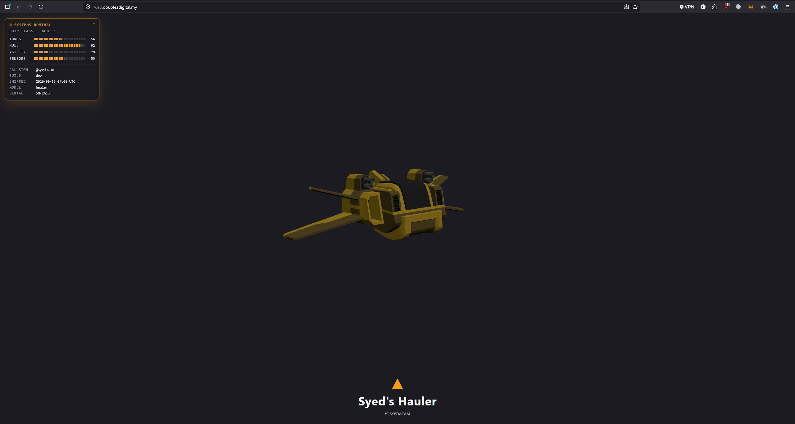
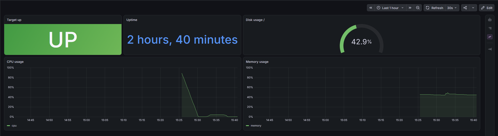
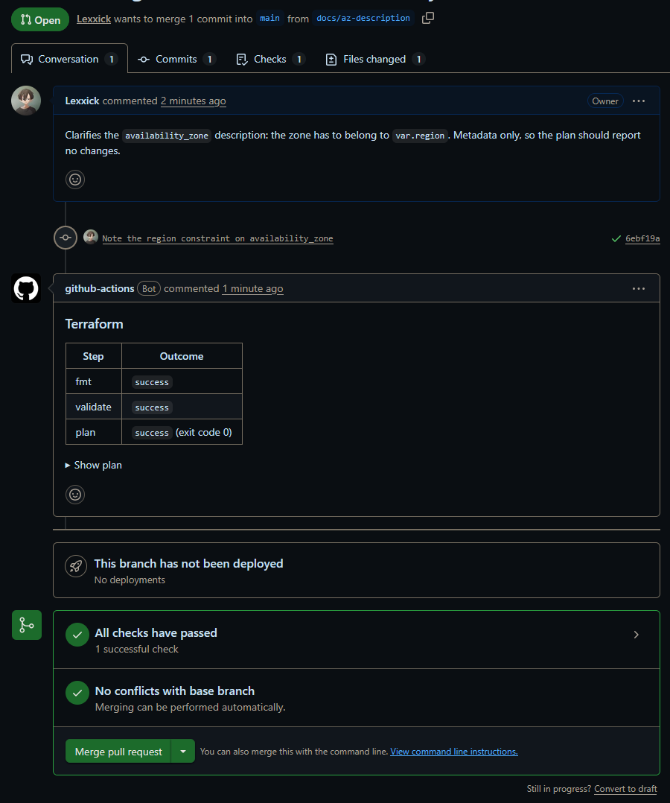
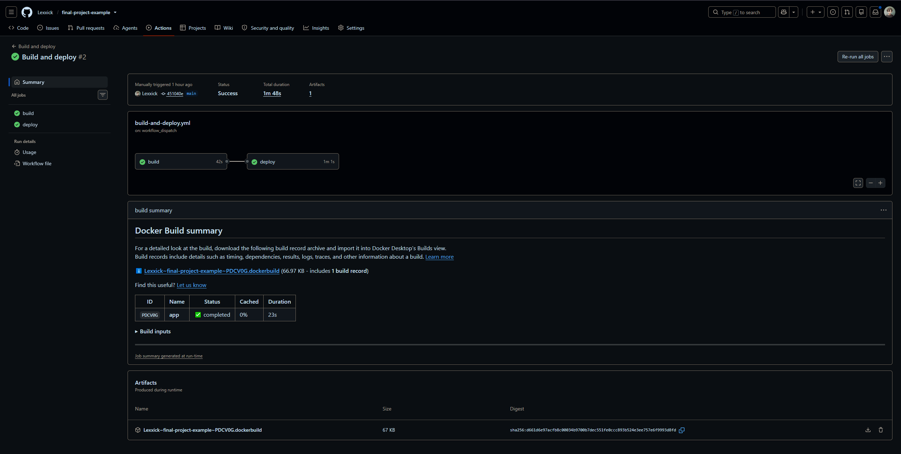
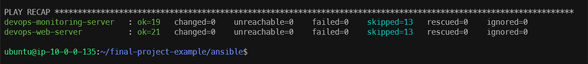

## Links

| | |
| --- | --- |
| Application | <https://web.doubleadigital.my> |
| Monitoring (Grafana) | <https://monitoring.doubleadigital.my> |
| Repository | <https://github.com/Lexxick/final-project-example> |

## Architecture

<div style="background:#0b0f19;border-radius:8px;padding:1rem 0.5rem;margin-bottom:1rem">
<div class="mermaid">
flowchart TB
    dev([Developer]) -- git push / PR --> gh[GitHub]
    gh -- OIDC, no keys --> actions[GitHub Actions]
    users([Browser]) -- HTTPS --> cf[Cloudflare]

    subgraph aws [AWS ap-southeast-1 · account 507861383583]
        ecr[(ECR<br/>devops-bootcamp/final-project-syedazam)]
        ssm[[Systems Manager<br/>Session Manager · Run Command · Parameter Store]]
        s3[(S3<br/>terraform state · ansible transfers)]
        subgraph vpc [devops-vpc 10.0.0.0/24]
            igw[devops-igw]
            subgraph pub [devops-public-subnet 10.0.0.0/25]
                web[devops-web-server<br/>10.0.0.5 + Elastic IP<br/>ship :80 · node_exporter :9100]
                ngw[devops-ngw]
            end
            subgraph priv [devops-private-subnet 10.0.0.128/25]
                ctl[devops-ansible-controller<br/>10.0.0.135<br/>site.yml at boot]
                mon[devops-monitoring-server<br/>10.0.0.136<br/>prometheus · grafana · cloudflared]
            end
        end
    end

    actions -- build & push --> ecr
    actions -- SendCommand --> ssm
    ssm -- web.yml --> ctl
    ctl -- aws_ssm connection --> web
    ctl -- aws_ssm connection --> mon
    web -- pull image --> ecr
    cf -- proxied A record --> igw --> web
    mon -- scrape :9100 --> web
    mon -- outbound tunnel --> cf
    priv -.-> ngw -.-> igw

    classDef external fill:#1f2937,stroke:#9ca3af,color:#f9fafb
    classDef service fill:#78350f,stroke:#f59e0b,color:#fef3c7
    classDef network fill:#1e293b,stroke:#64748b,color:#e2e8f0
    classDef web fill:#14532d,stroke:#22c55e,color:#dcfce7
    classDef controller fill:#1e3a8a,stroke:#60a5fa,color:#dbeafe
    classDef monitoring fill:#4c1d95,stroke:#a78bfa,color:#ede9fe
    class dev,users,gh,actions,cf external
    class ecr,ssm,s3 service
    class igw,ngw network
    class web web
    class ctl controller
    class mon monitoring
    style aws fill:#111827,stroke:#f59e0b,color:#fbbf24
    style vpc fill:#0f172a,stroke:#64748b,color:#cbd5e1
    style pub fill:#052e16,stroke:#22c55e,color:#86efac
    style priv fill:#172554,stroke:#60a5fa,color:#93c5fd
</div>
</div>
<script type="module">
  import mermaid from "https://cdn.jsdelivr.net/npm/mermaid@11/dist/mermaid.esm.min.mjs";
  mermaid.initialize({
    startOnLoad: true,
    theme: "base",
    themeVariables: {
      darkMode: true,
      background: "#0b0f19",
      primaryColor: "#1f2937",
      primaryTextColor: "#f9fafb",
      primaryBorderColor: "#9ca3af",
      lineColor: "#94a3b8",
      edgeLabelBackground: "#0b0f19",
      fontFamily: "'Open Sans', 'Helvetica Neue', Helvetica, Arial, sans-serif",
      fontSize: "15px"
    }
  });
</script>

Three Ubuntu 24.04 `t3.micro` instances in one VPC (`10.0.0.0/24`, `ap-southeast-1a`):

| Host | Subnet | Runs |
| --- | --- | --- |
| `devops-web-server` | public, Elastic IP | the ship container on `:80`, `node_exporter` on `:9100` |
| `devops-ansible-controller` | private | Ansible; reaches the other hosts over SSM |
| `devops-monitoring-server` | private | Prometheus, Grafana, `cloudflared` (outbound tunnel, no open port) |

Only the web server has a public address. Nothing listens on port 22: Session Manager gives the
shell, carries the Ansible connection and receives the deploy trigger from CI.

## Two layers

| Layer | Owns | Lifecycle |
| --- | --- | --- |
| **Foundation** | state bucket, ECR repository and its images, the web Elastic IP (`terraform/bootstrap/`), Cloudflare DNS and tunnel, the two Parameter Store secrets, the `AWS_ROLE_ARN` variable | created once, never destroyed with the stack |
| **Stack** | VPC, subnets, NAT, security groups, IAM roles and the OIDC provider, the three servers (`terraform/`) | `apply` and `destroy` at will; converges itself at boot |

Everything external points at the foundation – DNS at the Elastic IP, CI at the repository name –
so rebuilding the stack changes nothing outside AWS.

## How it works

- **Terraform** builds everything from `terraform-aws-modules` registry modules, state in S3; the
  foundation and the stack are two configurations with two state keys.
- **The controller** installs Ansible from its user data, clones this repository and runs
  `site.yml` – one `terraform apply` brings the whole stack up. All three instances first wait for
  their instance profile credentials and restart the SSM agent, which otherwise backs off for
  30 minutes if it starts too early.
- **Ansible** finds the hosts through the `aws_ec2` inventory (grouped by the `Role` tag) and talks
  to them over the `aws_ssm` connection. `site.yml` starts with `wait_for_connection`, so the
  boot-time run waits for the other two instances. Declarative modules only; a second run is
  `changed=0`.
- **Monitoring**: `node_exporter` on the web server, scraped by Prometheus every 15 s over the
  private network (the only inbound rule for `9100` is from the monitoring server); Grafana is
  provisioned from files and published through a Cloudflare tunnel, no port open.
- **CI/CD** authenticates with OIDC. A pull request touching `terraform/` gets a plan comment; a push
  to `app/` builds the image, pushes `sha-<short>` and `latest` to ECR, and runs `web.yml` on the
  controller through SSM Run Command – the same code path as a deploy by hand.

## IAM

| Role | Trust | Permissions |
| --- | --- | --- |
| `devops-web-role` | EC2 | `AmazonSSMManagedInstanceCore`; pull from the one ECR repository |
| `devops-controller-role` | EC2 | `AmazonSSMManagedInstanceCore`; `ssm:StartSession` on instances tagged `Project=devops-bootcamp`; `ec2:DescribeInstances` for the dynamic inventory; read `/devops-bootcamp/*` parameters; read/write the transfer bucket |
| `devops-monitoring-role` | EC2 | `AmazonSSMManagedInstanceCore` only |
| `devops-github-actions-role` | GitHub OIDC, `repo:Lexxick@234321683/final-project-example@1370915813:*` | `ReadOnlyAccess` for `terraform plan`; push to the ECR repository; `ssm:SendCommand` on instances tagged `Role=controller`; write the state lock file |

Every policy is scoped to the resource it is for; the only `*` resources are actions that do not
support resource-level permissions (`ecr:GetAuthorizationToken`, `ec2:DescribeInstances`,
`ssm:GetCommandInvocation`).

## Runbook

Prerequisites: AWS CLI v2 on account `507861383583` (region `ap-southeast-1`), Terraform ≥ 1.11,
Docker, the Session Manager plugin, a Cloudflare zone. Steps 1–5 are the foundation, done once.

### 1. Repository and Pages

Push this repository to `github.com/Lexxick/final-project-example` (public). In **Settings →
Pages** set *Source* to **GitHub Actions**. The controller clones the repository at boot, so this
must exist before `terraform apply`.

Repositories created after July 2026 present an immutable OIDC subject that carries the owner and
repository IDs. Put it in `terraform/terraform.tfvars` as `github_oidc_subject`:

```bash
gh api repos/Lexxick/final-project-example --jq '"\(.owner.login)@\(.owner.id)/\(.name)@\(.id)"'
```

### 2. State bucket

```bash
aws s3api create-bucket --bucket devops-bootcamp-terraform-syedazam-507861383583 \
  --region ap-southeast-1 --create-bucket-configuration LocationConstraint=ap-southeast-1
aws s3api put-bucket-versioning --bucket devops-bootcamp-terraform-syedazam-507861383583 \
  --versioning-configuration Status=Enabled
aws s3api put-public-access-block --bucket devops-bootcamp-terraform-syedazam-507861383583 \
  --public-access-block-configuration BlockPublicAcls=true,IgnorePublicAcls=true,BlockPublicPolicy=true,RestrictPublicBuckets=true
```

### 3. Registry, Elastic IP and the first image

```bash
cd terraform/bootstrap
terraform init
terraform apply                      # ECR repository, its policies, the Elastic IP
image="$(terraform output -raw repository_url):latest"
cd ../..
aws ecr get-login-password | docker login --username AWS --password-stdin "${image%%/*}"
docker build -t "$image" app/
docker push "$image"
```

The controller deploys `latest` at boot, so the registry needs one image before the first apply.
CI pushes every later one.

### 4. Cloudflare and secrets

1. **DNS**: add an `A` record `web` → the `web_public_ip` output of `terraform/bootstrap`, proxy
   status *Proxied*. **SSL/TLS → Overview**: set the encryption mode to *Flexible*.
2. **Zero Trust → Networks → Tunnels → Create a tunnel** (Cloudflared): name it `devops-bootcamp`,
   copy the token from the install command (the long string after `--token`).
3. In the tunnel's **Public Hostname** tab add `monitoring.doubleadigital.my` → service type **HTTP**,
   URL `grafana:3000`.

The monitoring playbook reads both secrets at boot, so they go in before the stack:

```bash
aws ssm put-parameter --name /devops-bootcamp/tunnel-token \
  --type SecureString --value '<tunnel token>'
aws ssm put-parameter --name /devops-bootcamp/grafana-admin-password \
  --type SecureString --value '<a strong password>'
```

### 5. Repository variable

**Settings → Secrets and variables → Actions → Variables**: add `AWS_ROLE_ARN` =
`arn:aws:iam::507861383583:role/devops-github-actions-role`. The name is fixed, so once.

### 6. Apply the stack

```bash
cd terraform
terraform init
terraform apply
aws ssm start-session --target "$(terraform output -raw controller_instance_id)"
sudo tail -f /var/log/cloud-init-output.log        # ends with the PLAY RECAP
```

About 15–20 minutes from `apply` to the recap: Docker on both hosts, the ship from ECR, the monitoring
stack. The OIDC provider and the CI role are part of the stack, so after a teardown the first
pull-request plan fails at *Configure AWS credentials* until the stack is applied again.

### 7. Verify

- <https://web.doubleadigital.my> shows the ship; `curl -I http://<web_public_ip>` returns `200`.
- <https://monitoring.doubleadigital.my> shows the Grafana login; the *Web Server* dashboard has data.
- On the monitoring server, `curl -s localhost:9090/api/v1/targets` lists `web-server` as `up`.
- A pull request that edits any `.tf` file gets the plan as a comment.
- On the controller, `ansible-playbook site.yml` a second time reports `changed=0` everywhere.

### 8. Shipping a change

Push to `app/` (or **Actions → Build and deploy → Run workflow**). The build job pushes
`sha-<short>` and `latest`; the deploy job runs `playbooks/web.yml` on the controller and only the
`ship` service is recreated.

### 9. Teardown

```bash
cd terraform && terraform destroy
```

The foundation stays: the next `apply` comes back with the last image, the same address, tunnel and
secrets. To remove everything, `terraform destroy` in `terraform/bootstrap/` (registry, images and
the Elastic IP), then the state bucket, the parameters, and the tunnel and DNS records in Cloudflare.

## Screenshots

**The application** – `web.doubleadigital.my` behind the proxied A record.



**Grafana** – the provisioned *Web Server* dashboard fed by `node_exporter`.



**Terraform plan on a pull request** – fmt, validate and plan posted by `terraform.yml`.



**Build and deploy** – image built, pushed to ECR and deployed through SSM Run Command.



**Session Manager** – a shell on the controller after the second `site.yml` run, `changed=0`.


